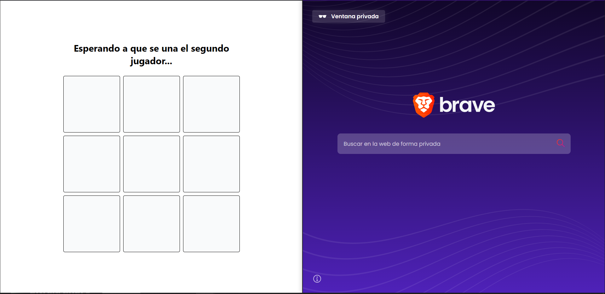
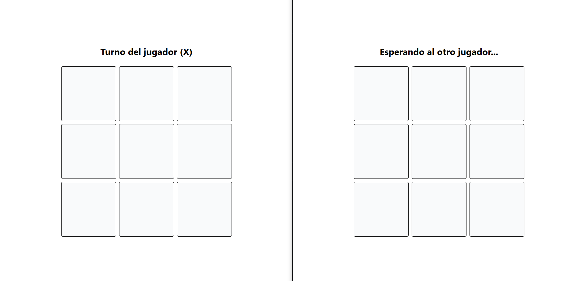
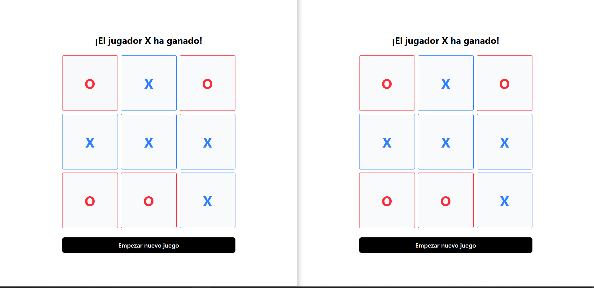
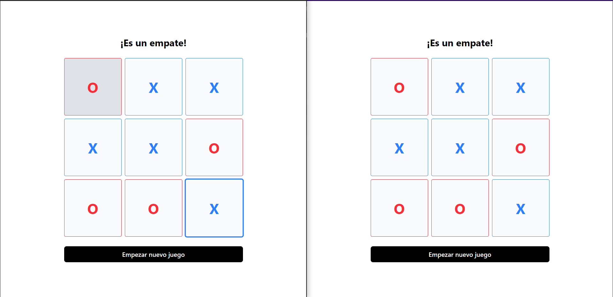

# 🕹️ Ta-Te-Ti Multijugador con WebSockets

Este proyecto fue desarrollado para aprender sobre WebSockets y la comunicación en tiempo real entre el backend y el frontend.

## 🚀 Tecnologías Utilizadas

### 🖥️ Frontend:
- **React** con **TypeScript**
- **StompJS** para la comunicación WebSocket
- **UUID** para generar identificadores únicos
- **Tailwind CSS** para los estilos

### 🔧 Backend:
- **Spring Boot**
- **Spring WebSocket**
- **Lombok**
- **Java 21**

---

## 📌 Cómo Empezar

### 🔍 Requisitos:
- Java 21 o superior
- Node.js y npm instalados
- Maven para construir el backend

### ▶️ Pasos para ejecutar el proyecto:

1. **Clona el repositorio:**
```
bash
git clone https://github.com/tuusuario/tres-en-raya-multijugador.git
cd tres-en-raya-multijugador
```
El servidor backend se iniciará en: http://localhost:8080

```
cd frontend
npm install
npm run dev
```
La aplicación se abrirá en http://localhost:5173

## 🎮 Cómo Jugar
1. El juego comienza cuando hay dos jugadores conectados.
2. Abre la aplicación en dos navegadores diferentes o en modo incógnito.
3. El primer jugador será X y el segundo jugador será O.
4. Los jugadores se turnan para hacer clic en las casillas del tablero.
5. El juego detecta automáticamente si hay un ganador o si hay un empate.
6. Para comenzar una nueva partida, haz clic en "Empezar nuevo juego" después de que termine la partida actual.

## 📸 Capturas de la aplicacion en funcionamiento







